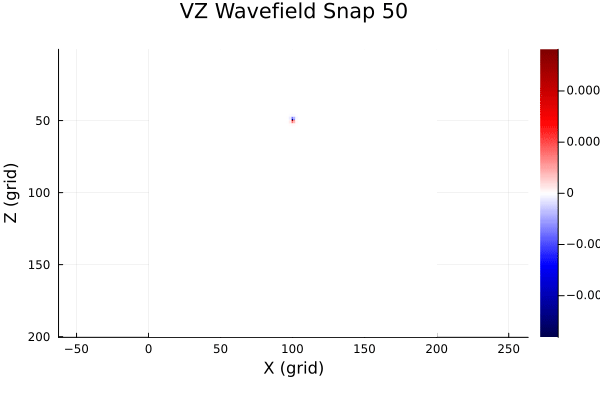
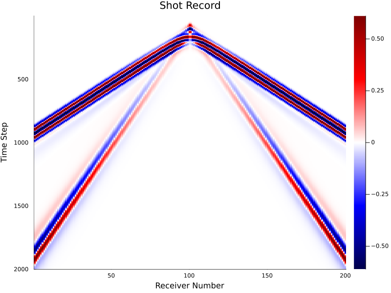

# Fomo.jl

**基于 GPU 加速的 2D/3D 声波与弹性波波动方程模拟器 Julia 工具包**

*在你的笔记本上运行地震正演模拟。*

> 🌐 **中文** | [English](README.md)


<p align="center">
  
</p>

Fomo 是一个基于 CUDA 的二维/三维波动方程模拟器，采用交错网格高阶有限差分方法求解声波方程和弹性波方程。虽然最初为地震波模拟而开发，但同样适用于任何涉及声波或弹性波传播的场景——地震正演、超声检测、无损探伤、医学成像、水声学等。

本工具还引入了一个全新的**耦合 P-S 势场求解器**，源自李云月（Yunyue Elita Li）教授的工作（Li et al., 2018），可传播天然分离的 P 波与 S 波势场并实现显式的模式分解——详见[下方说明](#耦合-p-s-势场求解器)。

---

## 目录

- [Fomo.jl](#fomojl)
  - [目录](#目录)
  - [特性](#特性)
  - [安装](#安装)
  - [快速开始](#快速开始)
    - [示例输出：炮记录](#示例输出炮记录)
  - [API 参考](#api-参考)
    - [正演模拟](#正演模拟)
    - [工具函数](#工具函数)
  - [耦合 P-S 势场求解器](#耦合-p-s-势场求解器)
    - [理论基础](#理论基础)
    - [实现：速度-位置分裂与二阶等效 HABC](#实现速度-位置分裂与二阶等效-habc)
    - [对比传统弹性波求解器](#对比传统弹性波求解器)
  - [性能与可复现性](#性能与可复现性)
  - [数值方法](#数值方法)
  - [环境要求](#环境要求)
  - [参考文献](#参考文献)
  - [致谢](#致谢)
  - [许可证](#许可证)

---

## 特性

- **声波 & 弹性波，2D & 3D** — 同时支持声波（压力-速度）和弹性波（应力-速度）方程，2D 与 3D 均有独立求解器
- **🆕 耦合 P-S 势场 2D** — 基于 Li et al. (2018) 的新型求解器，直接传播天然分离的 P 波和 S 波势场（详见[下方说明](#耦合-p-s-势场求解器)）
- **交错网格有限差分** — 最高支持 10 阶空间精度，有效压制数值频散
- **混合吸收边界条件 (HABC)** — 结合单程波方程与指数衰减（刘洋教授）；相比传统 PML 吸收更优，计算开销显著更低。另提供经典 Cerjan sponge 边界（`boundary=:sponge`，对比测试见 `example/benchmark/`）
- **Vacuum 自由表面** — 通过 vacuum 方法（速度和密度置零）在介质内任意位置模拟真实自由表面
- **入口参数校验** — 启动 GPU 核函数前检查震源/检波器几何越界与 CFL 稳定性（违反直接报错），并在最短波长采样不足时给出频散警告
- **🆕 二阶标量求解器** — `scalar2d` 求解常密度二阶标量波动方程，内存流量约为一阶格式的 1/3：带宽受限网格上快 2.5~3 倍（与 deepwave `scalar` 同公式）
- **🆕 多炮批处理** — `acoustic2d_batch` / `elastic2d_batch` 一次 GPU 调用同时推进 `n_shots` 炮；每炮结果与单炮运行逐位相同
- **🆕 高速且确定性的引擎** — 融合 CUDA 内核 + CUDA Graph（每时间步仅 1 次 graph launch，小中网格最高 ~2.6 倍提速），确定性两遍 HABC 使结果跨运行、跨显卡逐位可复现（详见[性能与可复现性](#性能与可复现性)）
- **GPU 加速** — 基于 [CUDA.jl](https://github.com/JuliaGPU/CUDA.jl)，在 NVIDIA GPU 上实现高性能计算
- **内置可视化** — 炮记录绘图与波场动画导出，以 package extension 形式在 `using Plots` 时按需加载（`using Fomo` 本体保持轻量快速）

## 安装

```julia
using Pkg
Pkg.add(url="https://github.com/zzzzswh/Fomo.jl")
```

## 快速开始

各求解器共享一致的调用方式，展开下方示例即可上手：

<details open>
<summary><b>声波 2D</b></summary>

```julia
using CUDA
using Fomo

# 网格参数
nx, nz = 400, 300
dh = 10.0f0
dt = 0.001f0
nt = 2000
f0 = 15.0f0

# 速度模型
vp  = fill(2500.0f0, nx, nz)
rho = fill(2000.0f0, nx, nz)

# Vacuum 自由表面（顶行置零）
vp[:, 1]  .= 0.0f0
rho[:, 1] .= 0.0f0

# 震源与检波器
sx = [nx ÷ 2];       sz = [10]
rx = collect(1:2:nx); rz = fill(10, length(rx))

# 正演模拟
res = acoustic2d(vp, rho, dh, dt, nt, f0;
    sx, sz, rx, rz,
    nbc=100, fd_order=8, snap_interval=50)
# res.seis_p / res.seis_vx / res.seis_vz / res.snaps / res.stats.kernel_time_s

# 可视化（需先 `using Plots` 以加载绘图扩展）
using Plots
plot_shot(trace_norm(res.seis_vz, dims=2), "acoustic_vz.png")
plot_wavefield_video(res.snaps, 50, "acoustic_wavefield.mp4",
    fps=10, adaptive_clims=true)
```

</details>

<details>
<summary><b>弹性波 2D</b></summary>

```julia
using CUDA
using Fomo

nx, nz = 400, 300
dh = 10.0f0
dt = 0.001f0
nt = 2000
f0 = 15.0f0

# 弹性模型：vp, vs, rho
vp  = fill(2500.0f0, nx, nz)
vs  = fill(1200.0f0, nx, nz)
rho = fill(2000.0f0, nx, nz)

# Vacuum 自由表面
vp[:, 1]  .= 0.0f0
vs[:, 1]  .= 0.0f0
rho[:, 1] .= 0.0f0

# 震源与检波器
sx = [nx ÷ 2];       sz = [10]
rx = collect(1:2:nx); rz = fill(10, length(rx))

# 正演模拟
res = elastic2d(vp, vs, rho, dh, dt, nt, f0;
    sx, sz, rx, rz,
    nbc=100, fd_order=8, snap_interval=50)
# res.seis_vx / res.seis_vz / res.snaps / res.stats.kernel_time_s

# 可视化（需先 `using Plots` 以加载绘图扩展）
using Plots
plot_shot(trace_norm(res.seis_vz, dims=2), "elastic_vz.png")
plot_wavefield_video(res.snaps, 50, "elastic_wavefield.mp4",
    fps=10, adaptive_clims=true)
```

</details>

<details>
<summary><b>耦合 P-S 势场 2D 🆕</b></summary>

```julia
using CUDA
using Fomo

nx, nz = 400, 300
dh = 10.0f0
dt = 0.001f0
nt = 2000
f0 = 15.0f0

# 只需 vp 和 vs —— 不需要密度（假设 ρ=1）
vp = fill(2500.0f0, nx, nz)
vs = fill(1200.0f0, nx, nz)
vp[:, 150:end] .= 3500.0f0
vs[:, 150:end] .= 1800.0f0

# 震源与检波器
sx = [nx ÷ 2];       sz = [10]
rx = collect(1:2:nx); rz = fill(10, length(rx))

# 正演模拟 —— 返回天然分离的 P 和 S 势场
res = coupled2d(vp, vs, dh, dt, nt, f0;
    sx, sz, rx, rz,
    nbc=100, fd_order=8, snap_interval=50)

# res.seis_P: P 波势场记录（包含 PP 反射）
# res.seis_S: S 波势场记录（包含 PS 转换波 —— 仅在 Vs 不连续处产生！）
```

</details>

<details>
<summary><b>声波 & 弹性波 3D</b></summary>

```julia
using CUDA
using Fomo

# 网格参数
nx, ny, nz = 101, 101, 101
dh = 10.0f0
dt = 0.001f0
nt = 500
f0 = 15.0f0

# 3D 速度模型
vp  = fill(3000.0f0, nx, ny, nz)
rho = fill(2000.0f0, nx, ny, nz)

# 震源置于模型中心；检波器沿 x 方向排列
sx = [nx ÷ 2]; sy = [ny ÷ 2]; sz = [nz ÷ 2]
rx = collect(1:nx)
ry = fill(ny ÷ 2, nx)
rz = fill(nz ÷ 2, nx)

# 正演模拟 —— 3D 求解器返回普通元组
seis_vx, seis_vy, seis_vz, snaps = acoustic3d(vp, rho, dh, dt, nt, f0;
    sx, sy, sz, rx, ry, rz,
    nbc=50, fd_order=8,
    snap_interval=50,
    snap_plane=:xz,     # 快照切片方向：:xy、:xz 或 :yz
    snap_index=ny ÷ 2)  # 沿剩余轴的切片索引

# 弹性波 3D 用法相同 —— 只需加上 vs：
# vs = fill(1700.0f0, nx, ny, nz)
# seis_vx, seis_vy, seis_vz, snaps = elastic3d(vp, vs, rho, dh, dt, nt, f0;
#     sx, sy, sz, rx, ry, rz, nbc=50, fd_order=8)
```

</details>

<details>
<summary><b>二阶标量 & 多炮批处理 🆕</b></summary>

```julia
using CUDA
using Fomo

nx, nz = 500, 400
dh, dt, nt, f0 = 10.0f0, 0.001f0, 2000, 15.0f0
vp  = fill(2500.0f0, nx, nz)
rho = fill(2000.0f0, nx, nz)
rx = collect(1:2:nx); rz = fill(10, length(rx))

# 二阶标量（常密度）：内存流量约为一阶路径的 1/3 —— 与 deepwave `scalar` 同公式
res = scalar2d(vp, dh, dt, nt, f0;
    sx=[nx ÷ 2], sz=[10], rx, rz)
# res.seis_u :: (n_rec, nt)

# 多炮批处理（检波器排列各炮共享，震源逐炮给定）。
# 注意：这里向量表示【每炮一个震源】—— 与单炮 API 语义不同，
# 单炮 API 的向量表示同一炮内的多个震源。
res = acoustic2d_batch(vp, rho, dh, dt, nt, f0;
    sx=[100, 250, 400], sz=fill(10, 3), rx, rz)
# res.seis_p :: (n_rec, nt, 3)；每炮与单炮运行逐位相同
```

</details>

### 示例输出：炮记录

<p align="center">
  
</p>

## API 参考

### 正演模拟

| 函数 | 说明 |
|---|---|
| `acoustic2d(vp, rho, dh, dt, nt, f0; ...)` | 2D 声波方程正演 |
| `elastic2d(vp, vs, rho, dh, dt, nt, f0; ...)` | 2D 弹性波方程正演 |
| `scalar2d(vp, dh, dt, nt, f0; ...)` | 🆕 2D 二阶标量（常密度），与 deepwave `scalar` 同公式 |
| `acoustic2d_batch(vp, rho, dh, dt, nt, f0; ...)` | 🆕 2D 声波多炮批处理 |
| `elastic2d_batch(vp, vs, rho, dh, dt, nt, f0; ...)` | 🆕 2D 弹性波多炮批处理 |
| `coupled2d(vp, vs, dh, dt, nt, f0; ...)` | 🆕 2D 耦合 P-S 势场正演 |
| `acoustic3d(vp, rho, dh, dt, nt, f0; ...)` | 3D 声波方程正演 |
| `elastic3d(vp, vs, rho, dh, dt, nt, f0; ...)` | 3D 弹性波方程正演 |

**通用关键字参数（所有求解器）：**

| 参数 | 默认值 | 说明 |
|---|---|---|
| `sx, sz`（3D 另加 `sy`） | — | 震源位置（网格索引） |
| `rx, rz`（3D 另加 `ry`） | — | 检波器位置（网格索引） |
| `nbc` | `50` | 吸收边界层网格点数 |
| `fd_order` | `8` | 有限差分阶数（2, 4, 6, 8 或 10） |
| `snap_interval` | `0` | 波场快照间隔（0 = 不保存快照） |

**所有 2D 求解器（`acoustic2d` / `elastic2d` / `coupled2d`）：**

| 参数 | 默认值 | 说明 |
|---|---|---|
| `wavelet` | `nothing` | 自定义震源子波（长度 `nt` 的向量；`nothing` → Ricker(f0)） |
| `verbose` | `true` | 是否打印进度日志 |

**仅 `acoustic2d` / `elastic2d`：**

| 参数 | 默认值 | 说明 |
|---|---|---|
| `boundary` | `:habc` | 吸收边界类型：`:habc` 或 `:sponge`（Cerjan） |
| `v_ref` | `min(vp)` | HABC 参考速度（`:sponge` 时忽略） |
| `sponge_factor` | `0.015` | Cerjan 衰减系数（`:habc` 时忽略） |
| `scale_source_by_dt` | `false` | 注入前将子波乘以 `dt`，使震源振幅在改变 `dt` 时保持物理一致（对齐 deepwave 约定） |
| `use_cuda_graph` | `true` | `boundary=:habc` 且无快照时，把整个时间步录制为一张 CUDA Graph（capture 失败自动回退融合循环） |

**仅 `scalar2d`**（边界固定 HABC；暂不支持快照）：

| 参数 | 默认值 | 说明 |
|---|---|---|
| `source_scale` | `:v2dt2` | 震源缩放：`:v2dt2`（× 源点 v²·dt²，deepwave 约定）、`:dt` 或 `:none` |

**`acoustic2d_batch` / `elastic2d_batch`**（边界固定 HABC；暂不支持快照；检波器各炮共享）：

| 参数 | 默认值 | 说明 |
|---|---|---|
| `sx, sz` | — | `(n_shots × n_src_per_shot)` 整数矩阵；**传向量视为每炮 1 个震源** —— 注意与单炮 API 语义不同（单炮 API 的向量是同一炮内的多个震源） |

**`coupled2d` 额外关键字参数：**

| 参数 | 默认值 | 说明 |
|---|---|---|
| `v_ref_p` | `min(vp)` | P 场 HABC 参考速度 |
| `v_ref_s` | `min(vs)` | S 场 HABC 参考速度 |
| `smooth_sigma` | `3.0` | 介质参数高斯平滑标准差（网格点数）；平滑后的 α、β 用于耦合/散射项（∇α, ∇β, ∇²α, ∇²β），传播项仍用原始模型。设为 `0.0` 可关闭 |

**`acoustic3d` / `elastic3d` 额外关键字参数：**

| 参数 | 默认值 | 说明 |
|---|---|---|
| `snap_plane` | `:xz` | 快照切片方向：`:xy`、`:xz` 或 `:yz` |
| `snap_index` | `ny ÷ 2` | 垂直于 `snap_plane` 方向的切片索引 |
| `v_ref` | `min(vp)` | HABC 参考速度 |

**返回值：**
- `acoustic2d` → NamedTuple `(; seis_p, seis_vx, seis_vz, snaps, stats)`
- `elastic2d` → NamedTuple `(; seis_vx, seis_vz, snaps, stats)`
- `coupled2d` → NamedTuple `(; seis_P, seis_S, snaps_P, snaps_S, stats)`
- `scalar2d` → NamedTuple `(; seis_u, stats)`
- `acoustic2d_batch` → NamedTuple `(; seis_p, seis_vx, seis_vz, stats)`，地震记录形状 `(n_rec, nt, n_shots)`
- `elastic2d_batch` → NamedTuple `(; seis_vx, seis_vz, stats)`，同为 `(n_rec, nt, n_shots)`
- `acoustic3d` / `elastic3d` → 普通元组 `(seis_vx, seis_vy, seis_vz, snaps)`；快照为 2D 切片（声波取压力场，弹性波取 `vz`），位置由 `snap_plane` / `snap_index` 决定
- `stats.kernel_time_s`：GPU 主循环耗时（不含调用内 warmup）

**场的交错位置**（与其他软件对比时注意半格偏移）：
`p`/`τxx`/`τzz` 位于 `(i, j)`，`vx` 位于 `(i−1/2, j)`，`vz` 位于 `(i, j+1/2)`，`τxz` 位于 `(i−1/2, j+1/2)`。

### 工具函数

| 函数 | 说明 |
|---|---|
| `ricker_wavelet(f0, dt, nt)` | 生成 Ricker 子波 |
| `trace_norm(data; dims)` | 逐道归一化 |
| `plot_shot(data, filename)` | 保存炮记录图 |
| `plot_wavefield_video(snaps, interval, filename; fps, adaptive_clims)` | 导出波场动画视频 |

> `plot_shot` 与 `plot_wavefield_video` 位于 package extension 中——需先 `using Plots` 才可用。

## 耦合 P-S 势场求解器

### 理论基础

基于 **Li et al. (2018)** *"Elastic reverse time migration using acoustic propagators"* (Geophysics, Vol. 83, No. 5, S399–S408)，在常密度各向同性弹性介质中推导了 P 波和 S 波势场满足的耦合二阶方程：

$$\ddot{P} = P\nabla^2\alpha + 2\nabla\alpha\cdot\nabla P - 2P\nabla^2\beta - 2\nabla\beta\cdot(\nabla\times\mathbf{S}) + \alpha\nabla^2 P + \nabla\cdot\mathbf{f}$$

$$\ddot{\mathbf{S}} = \nabla\beta\cdot\nabla\mathbf{S} - (\nabla\beta)\times(\nabla\times\mathbf{S}) + 2(\nabla\beta)\times(\nabla P) + \beta\nabla^2\mathbf{S} + \nabla\times\mathbf{f}$$

其中 α = V²_P、β = V²_S 为 P、S 波速度的平方，P = ∇·**u** 为 P 波势场（标量），**S** = ∇×**u** 为 S 波势场（矢量；2D 中仅 y 分量 S_y 非零）。

**方程揭示的关键物理：**

1. **模式转换仅在 V_S 不连续处发生** — 若 ∇β = 0，P 波与 S 波完全解耦
2. **V_P 不连续面对 S 波透明** — 纯 V_P 扰动不产生 PS 转换波
3. P 波与 S 波势场**天然分离**，无需 Helmholtz 分解

### 实现：速度-位置分裂与二阶等效 HABC

直接对二阶方程做 leapfrog 时间推进，每步只能施加一次 HABC，等效于一阶 Higdon ABC，斜入射吸收不足。

**核心设计：将 leapfrog 改写为速度-位置分裂格式**，使其与 velocity-stress 交错时间方案结构同构：

| Velocity-Stress (elastic2d) | Velocity-Position (coupled2d) |
|---|---|
| v_x, v_z（质点速度） | dP/dt, dS/dt（势场变化率） |
| τ_xx, τ_zz, τ_xz（应力） | P, S（势场） |
| update_velocity → **HABC** | update_velocity → **HABC** |
| update_stress → **HABC** | update_position → **HABC** |

每步**两次 HABC**，等效于**二阶 Higdon ABC**，吸收效果与传统弹性波求解器一致。

### 对比传统弹性波求解器

| | elastic2d | coupled2d |
|---|---|---|
| 波场数组 (2D) | 10 个 (vx, vz, τ_xx, τ_zz, τ_xz + 备份) | 8 个 (P, S, dP/dt, dS/dt + 备份) |
| 内存占用 | 5n² | 4n² **（减少 20%）** |
| P/S 分离 | 需要 Helmholtz 分解 | **天然内置** |
| 模式转换 | 隐式 | **显式（仅在 ∇β ≠ 0 处）** |
| 成像条件 | 需要额外的相位校正 | **与物理扰动一致** |
| 密度要求 | 任意 | 常密度 (ρ = const) |

## 性能与可复现性

HABC 路径下，2D 引擎把每相的边界备份与 PDE 更新融合为单个内核、边界工作用帧映射线程（零空转），并把整个时间步录制为一张 **CUDA Graph** —— 每步仅 1 次 graph launch。Higdon 边界修正采用**确定性两遍方案**，结果跨运行、跨 launch 几何、跨显卡**逐位可复现**；批处理中每一炮同样与其单炮运行逐位相同。

RTX 3060 实测吞吐（Float32，HABC，`fd_order=8`，`nbc=50`，多次运行取中位数；数据中心级 GPU 可进一步扩展）：

| 网格 | `acoustic2d` (steps/s) | `scalar2d` (steps/s) | `elastic2d` (steps/s) |
|---|---|---|---|
| 240×200 | ~25,000 | ~24,400 | ~17,000 |
| 500×400 | ~11,800 | ~23,800 | ~7,700 |
| 1000×800 | ~4,400 | ~11,800 | ~2,600 |
| 2000×1600 | ~1,300 | ~4,100 | — |

常密度声波在大网格（带宽受限）上推荐使用 `scalar2d`：其每步内存流量约为一阶格式的 1/3。验证脚本位于 `test/`：`verify_det_graph.jl`（确定性 + CUDA Graph 逐位等价）、`verify_batch.jl`（批处理逐炮逐位等价）、`verify_scalar.jl`（标量格式对照无 race 的 CPU 参考 + 网格自收敛）、`compare_fused*.jl`（内核融合与旧内核序列的等价性）、`bench_*.jl`（吞吐基准）。

## 数值方法

Fomo 实现了四类波动方程求解器：

- **声波 & 弹性波（2D 与 3D）** — 标准交错网格 velocity-stress 方案（Virieux, 1986），最高支持 10 阶 FD 算子，二阶蛙跳时间推进，HABC 吸收边界（刘洋教授）。2D 求解器还可选用 Cerjan sponge 边界（`boundary=:sponge`）。
- **耦合 P-S 势场（2D）** — 基于 Li et al. (2018) 的耦合二阶势场方程，分解为与 velocity-stress 方案结构同构的速度-位置分裂格式（详见[上文](#耦合-p-s-势场求解器)）。使用正则网格上的中心差分算子（非交错）。
- **二阶标量（2D）** — 正则网格上的常密度标量波动方程：中心差分算子（最高 10 阶）、蛙跳时间推进、共用确定性 HABC。这与 deepwave `scalar` 求解器同公式，内存流量约为一阶声波路径的 1/3。

所有入口在启动 GPU 核函数前都会校验震源/检波器几何与 CFL 稳定性条件（违反直接抛出错误），并在网格对最短波长采样不足时发出频散风险警告。

## 环境要求

- Julia ≥ 1.10
- 支持 CUDA 的 NVIDIA GPU
- CUDA.jl ≥ 5.0

## 参考文献

- **Li, Y. E., Du, Y., Yang, J., Cheng, A., & Fang, X. (2018).** Elastic reverse time migration using acoustic propagators. *Geophysics*, 83(5), S399–S408. doi: [10.1190/GEO2017-0687.1](https://doi.org/10.1190/GEO2017-0687.1)
- **Virieux, J. (1986).** P-SV wave propagation in heterogeneous media: Velocity-stress finite-difference method. *Geophysics*, 51(4), 889–901.
- **Cerjan, C., Kosloff, D., Kosloff, R., & Reshef, M. (1985).** A nonreflecting boundary condition for discrete acoustic and elastic wave equations. *Geophysics*, 50(4), 705–708.

## 致谢

- 混合吸收边界条件：基于刘洋教授的工作
- Sponge 吸收边界：Cerjan et al. (1985)
- 交错网格有限差分格式：Virieux (1986)
- 耦合 P-S 势场方程：Li et al. (2018)

## 许可证

MIT